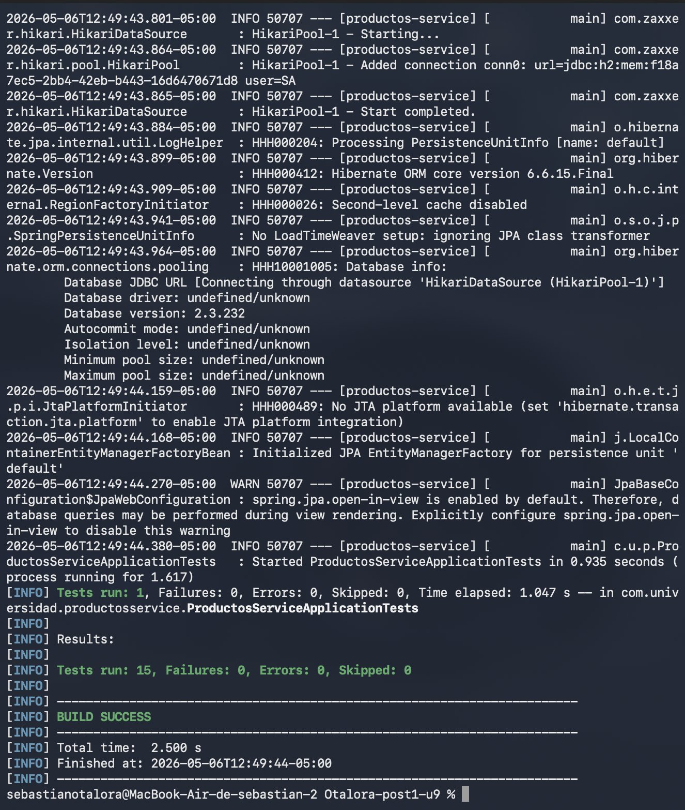

# Productos Service — Post-Contenido 1 Unidad 9

Microservicio de gestión de productos con suite completa de pruebas unitarias usando JUnit 5 y Mockito.

## Descripción

Aplicación Spring Boot que implementa la capa de servicio de un sistema de gestión de productos, incluyendo:

- Entidad JPA `Producto` con validaciones de columna
- Repositorio `ProductoRepository` extendiendo `JpaRepository`
- Servicio `ProductoServiceImpl` con validaciones de negocio (nombre, precio, stock)
- Controlador REST `ProductoController` con manejo de excepciones
- Suite de **15 pruebas unitarias** con escenarios positivos, negativos y de borde

## Tecnologías

- Java 21
- Spring Boot 3.5.0 (Spring Web, Spring Data JPA)
- H2 Database (test)
- Lombok
- JUnit 5 + Mockito
- Maven

## Estructura del Proyecto
src/
├── main/java/com/universidad/productosservice/
│   ├── domain/Producto.java
│   ├── repository/ProductoRepository.java
│   ├── service/ProductoService.java
│   ├── service/ProductoServiceImpl.java
│   └── controller/ProductoController.java
└── test/java/com/universidad/productosservice/
└── service/ProductoServiceImplTest.java
## Ejecutar las pruebas

```bash
./mvnw test
```

## Pruebas Implementadas

| # | Tipo | Nombre |
|---|------|--------|
| 1 | Happy path | `crear_datosValidos_retornaProductoGuardado` |
| 2 | Happy path | `buscarPorId_existente_retornaProducto` |
| 3 | Error | `buscarPorId_noExistente_lanzaRuntimeException` |
| 4 | Parametrizada | `crear_nombreInvalido_lanzaIllegalArgumentException` (5 valores) |
| 5 | Parametrizada | `crear_precioInvalido_lanzaIllegalArgumentException` (4 valores) |
| 6 | ArgumentCaptor | `crear_nombreConEspacios_guardaNombreNormalizado` |
| 7 | Verificación | `eliminar_productoExistente_llamaDeleteById` |

**Total: 15 pruebas (incluyendo todos los valores parametrizados)**

## Evidencia de Ejecución



## Autor

Sebastian Otalora — Ingeniería de Sistemas — UDES 2026
